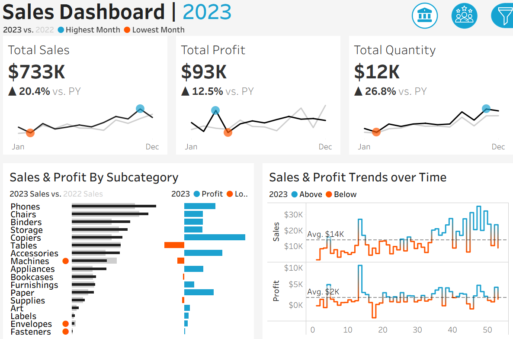

# 📊 Sales Data Regression & Classification Analysis

## 1. Project Overview
This project analyzes sales transactions, customer data, product details, and regional information to uncover business insights and build predictive models.

👉 [Click here to view the Interactive Tableau Dashboard]([https://public.tableau.com/views/YOUR_DASHBOARD_LINK](https://public.tableau.com/app/profile/yassir.sa6805/viz/SalesCustomerDashboards_17575947550970/SalesDashboard))

**Objectives:**
- Identify key drivers of sales and profitability.  
- Predict future sales using regression models.  
- Classify orders as profitable or not using classification models.  
- Visualize insights with clear plots and dashboards.  

**Datasets:**
- `Orders.csv` → transactional sales data  
- `Products.csv` → product categories & details  
- `Customers.csv` → customer profiles  
- `Location.csv` → geographic context  

---

## 2. Data Preparation
- Cleaned inconsistent numerical formats (commas, spaces).  
- Converted dates (`Order Date`, `Ship Date`) into datetime objects.  
- Merged datasets on **Product ID**, **Customer ID**, and **Postal Code**.  

**Engineered Features:**
- `LogSales` → log-transformed sales (reduces skewness).  
- `Profitable` → binary indicator (profit > 0).  
- `Year` → extracted from order date.  

---

## 3. Regression Analysis (Predicting Sales)

### Models Tested
- **OLS Regression** (baseline)  
- **Linear Regression**  
- **Ridge Regression** (reduces overfitting)  
- **Lasso Regression** (feature selection)  
- **ElasticNet** (balance Ridge & Lasso)  

### Key Findings
- Linear Regression achieved **R² ≈ 0.70**, meaning Quantity & Discount explain most of sales variation.  
- **Quantity** is the strongest positive predictor of sales.  
- **Discount** has a strong negative effect — high discounts reduce revenue.  

### Visuals
- **Actual vs Predicted Scatter Plot** → predictions aligned well, except some outliers.  
- **Residual Plot** → residuals centered around zero (no major bias).  
- **Coefficient Plot** → confirms Quantity (+) vs Discount (–).  

---

## 4. Classification Analysis (Profitable vs Not Profitable)

### Model Used
- Logistic Regression using Quantity & Discount.  

### Results
- **Accuracy:** ~0.75  
- **ROC AUC:** ~0.80  

### Visual
- **ROC Curve** → strong separation from random guessing baseline.  

### Interpretation
- High discounts → more likely unprofitable.  
- Large quantities → improve profitability.  

---

## 5. Business Insights
- **Discount Management** → excessive discounts hurt margins.  
- **Bulk Sales** → larger orders drive higher revenues.  
- **Customer Segmentation** → identify high-value segments for targeting.  
- **Regional Analysis** → detect underperforming regions for strategy adjustment.  

---

## 6. Deliverables

### 📂 Outputs (`/outputs/`)
- **Statistical Summary:** `ols_summary.txt`  
- **Saved Models:** Linear, Ridge, Lasso, ElasticNet, Logistic (`.joblib`)  
- **Graphs:**  
  - `linear_regression_scatter.png`  
  - `residuals.png`  
  - `coefficients.png`  
  - `roc_curve.png`  

### 📊 Dashboards
- Tableau dashboards : sales performance, customer segmentation.  

### 🐍 Scripts & Notebooks
- `scripts/regression_analysis.py` → full workflow (data cleaning, modeling, visualization).  

---
